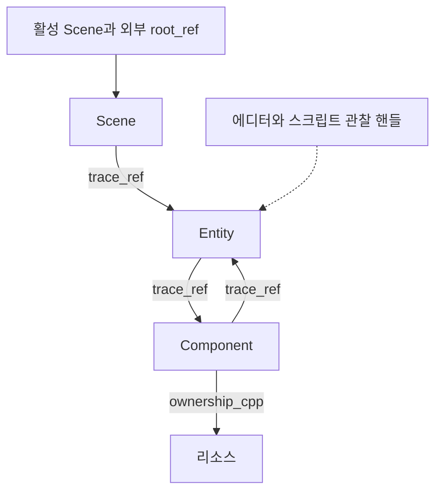
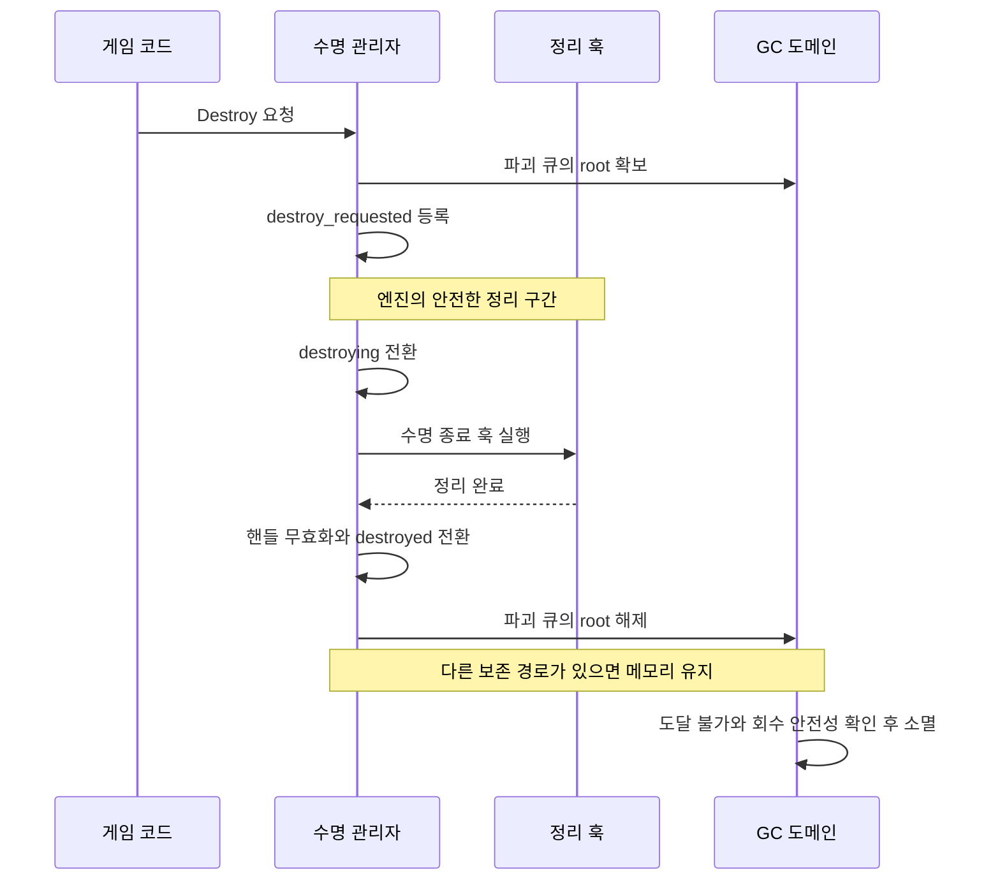

# CreatorEngine 자체 GC 설계와 도입 계획

Scene, Entity, Component의 메모리 수명을 자체 GC로 관리하고, 리소스의 참조 카운트와 유니크 소유권은 ownership_cpp로 관리한다. 엔진의 논리적 파괴와 GC의 실제 회수를 분리하여, 정리 훅의 실행 순서와 참조 안전성을 유지하면서 수집 비용을 통제한다.

작성일은 2026년 10월 8일이며 문서 버전은 0.2이다. 0.2에서는 계획 검토에서 나온 회수 중 참조 동작, weak 승격 스레드, 위반 사이클 정책, 판정 확정 비용, 컨테이너 재배치 barrier 비용을 반영했다. 공개 참조 타입명과 적용 범위는 대화에서 결정한 내용을 반영한다. 첫 구현의 실행 모델은 GameThread 증분 수집을 기준안으로 삼고, 완전 동시 수집은 성능 검증 이후의 선택지로 둔다.

이 계획의 첫 제품 목표는 **명시적 루트와 정확한 추적을 사용하는 nonmoving mark-and-sweep**이다. GC 작업을 엔진이 통제하는 구간에서 나누어 수행하며, 초기 버전은 STW-free 또는 엄격한 최대 정지 시간을 보장하지 않는다.

## 1 설계 결정과 적용 범위

### 결정 상태

| 구분 | 항목 | 내용 |
| --- | --- | --- |
| 확정 | 네임스페이스 | `gc` |
| 확정 | 공개 참조 타입 | `gc::root_ref<T>`, `gc::trace_ref<T>`, `gc::weak_ref<T>` |
| 확정 | GC 적용 대상 | Scene, Entity, Component 및 이들의 수명 관리에 필요한 내부 메타데이터 |
| 확정 | 리소스 수명 | ownership_cpp의 참조 카운트와 유니크 소유권 규약 사용 |
| 확정 | 논리적 소멸 지원 | 공통 상태 표기와 조회 경로를 두고 엔진이 상태 전이를 관리 |
| 첫 구현 기준안 | 추적과 회수 | 명시적 루트, 정확한 추적, 객체 주소를 유지하는 mark-and-sweep |
| 첫 구현 기준안 | 실행 모델 | GameThread에서 marking과 sweep을 예산에 맞춰 분할 |
| 첫 구현 기준안 | 참조 변경 | insertion write barrier 적용 |
| 첫 구현 기준안 | 자동 수집 | 할당량, 경과 시간, 수명 이벤트, 메모리 압력에 따라 요청 |
| 후속 결정 | 동시성과 세대 | concurrent marking, background sweep, generational GC |
| 구현 전 확정 | 세부 정책 | 참조 역방향의 보존 의미, 예산 값, 할당자, DLL 경계, 배포 라이선스 |

### 목표

1. 강한 참조로 도달 가능한 객체를 회수하지 않는다.
2. 루트가 사라진 순환 그래프를 회수한다.
3. 논리적 파괴의 정리 훅과 스크립트 접근 순서를 유지한다.
4. 수집 작업의 프레임 비용, 회수 지연, 메모리 사용량을 함께 관찰하고 조정한다.
5. 범용 C++ 힙과 스택을 자동 분석하는 기능을 초기 범위에서 제외하여 구현 범위를 통제한다.

텍스처, 메시, 머티리얼, GPU 객체, 자산 캐시, 작업용 임시 메모리는 이번 tracing GC의 수집 대상에 포함하지 않는다. Component가 보유하는 리소스 소유권은 논리적 정리 또는 해당 리소스의 별도 수명 규약에 따라 해제한다.

비활성화, 시뮬레이션 중단, Scene 이탈, DDOL 이송은 논리적 파괴와 별개의 사건이다. 이 동작만으로 객체를 `destroyed` 상태로 전환하지 않는다.

## 2 SGCL에서 참고할 부분과 첫 구현의 경계

SGCL은 스레드별 할당자와 상태 기록을 두고, 공유 힙의 도달 가능성을 중앙 collector와 보조 작업자가 판단하는 구조다. 객체를 할당한 스레드가 그 객체를 독립적으로 수집하는 구조로 해석하지 않는다. 정상 수집에는 모든 실행 스레드를 일제히 멈추는 단계가 없지만, 할당 실패 경로에서는 수집 완료를 기다릴 수 있다. [SGCL Collector](https://github.com/pebal/sgcl/blob/154efa921f5c8b9a2a16b0a8662502683c561b99/sgcl/core/detail/collector.h), [SGCL 페이지 할당](https://github.com/pebal/sgcl/blob/154efa921f5c8b9a2a16b0a8662502683c561b99/sgcl/core/detail/page_allocator.h)

| 참고할 방향 | 첫 구현에 적용하는 방식 |
| --- | --- |
| 수집 요청의 자동화 | 할당과 수명 이벤트가 요청을 기록하고 엔진 루프가 처리 |
| 할당과 추적의 역할 분리 | 할당자는 저장 공간, collector는 도달 가능성과 회수를 담당 |
| 참조 변경 추적 | root_ref와 trace_ref의 변경 경로에 barrier 적용 |
| 메모리 압력 대응 | 일찍 수집을 시작하고 진행량과 남은 여유를 함께 판단 |
| 전체 런타임에서의 수명 조정 | 엔진 인스턴스의 GC 도메인 전체에서 참조 그래프를 관리 |

첫 버전에는 보수적 스택 스캔, 임의 메모리에서의 포인터 추정, 실행 중인 일반 컨테이너의 동시 탐색, 객체 이동, 세대별 수집을 포함하지 않는다. 스레드별 allocator는 할당 병목이 확인될 때 추가할 수 있으며, 그 도입이 독립적인 스레드별 GC를 의미하지 않는다.

동시 수집 도입 여부는 평균 GC 시간만으로 결정하지 않는다. 프레임 지연의 p99와 최악값, 수집 완료 시간, 추가 보존 메모리, 참조 대입 비용을 함께 비교한다. 동시 GC가 CPU 시간과 메모리 여유의 교환관계를 없애지는 않는다. [Go 공식 GC 비용 설명](https://go.dev/doc/gc-guide)

## 3 객체 그래프와 메타데이터

### 수명 도메인

첫 기준안은 하나의 엔진 인스턴스가 Scene 객체용 GC 도메인을 소유하는 구조다. 여러 Scene이 존재하더라도 같은 도메인에서 참조를 추적하여 Scene 사이의 참조를 처리한다. DLL마다 별도 collector나 루트 등록소가 의도치 않게 생기지 않도록 런타임 진입점을 공유한다.

SceneManager가 보존 책임을 가진 Scene은 활성 여부와 관계없이 root로 유지한다. 로드 완료 후 활성화 대기, 편집과 재생 전환에서 보존하는 Scene, 비동기 완료 메시지의 Scene도 게시 또는 취소가 끝날 때까지 명시적인 root를 가진다. 소유 목록과 단순 활성 Scene 관찰 포인터는 구분한다.



그림의 Component에서 Entity로 향하는 간선은 강한 참조가 필요한 경우의 예다. Parent와 Owner 역참조는 부모 생존을 연장해야 하는지에 따라 정책을 정한다. 기본 소유 방향인 Scene에서 Entity, Entity에서 Component는 강한 추적 간선으로 표현한다. 단순 관찰 관계를 강한 간선으로 바꾸어 Scene 전체를 불필요하게 보존하지 않는다.

### 공통 메타데이터

| 정보 | 목적 |
| --- | --- |
| 안정적인 객체 식별자와 슬롯 세대 | 해제 후 같은 슬롯을 재사용해도 이전 약한 참조와 구분 |
| 타입별 추적 함수 | 기반 클래스와 모든 강한 참조 필드 열거 |
| 타입별 소멸 함수 | 실제 회수 시 C++ 객체 소멸 |
| mark 상태 또는 epoch | 이번 수집에서의 도달 가능성과 진행 상태 |
| 할당 시점 또는 serial | 현재 sweep 대상과 이후 생성된 객체 구분 |
| 논리적 수명 상태 | 엔진의 파괴 요청과 정리 완료 표현 |
| 회수 단계 상태 | weak 승격 가능 여부와 회수 확정 구분 |

논리적 수명 상태, GC mark 상태, 슬롯 세대는 서로 다른 의미로 유지한다. 논리적 상태는 객체용 공통 메타데이터 한 곳을 권위값으로 삼고, 참조마다 복사해 보관하지 않는다. 메타데이터를 GC 헤더에 함께 배치할 수 있지만, 엔진의 상태 전이와 collector의 회수 판정은 분리한다.

모든 대상 타입에 공통 기반 클래스의 상속을 강제할 필요는 없다. 타입별 등록과 방문 함수를 통해 동일한 계약을 제공할 수 있다. 다중 상속이나 기반 클래스 참조를 허용한다면 객체 식별자와 접근 포인터 사이의 보정을 명시적으로 처리한다.

## 4 참조 타입과 접근 규약

| 타입 | 생존에 미치는 영향 | 기본 사용 위치 |
| --- | --- | --- |
| `gc::root_ref<T>` | 외부 루트로 대상과 도달 가능한 그래프를 보존 | 활성 Scene, 생성 스코프, 파괴 큐, 명시적 비동기 보존 |
| `gc::trace_ref<T>` | 소유 객체가 도달 가능할 때 따라가는 강한 간선 | Scene과 Entity의 저장소, Component의 강한 대상 참조 |
| `gc::weak_ref<T>` | 대상을 생존시키지 않음 | 관찰, 에디터 선택, 외부 조회와 캐시 |
| 일시적인 raw pointer | 자체적으로 생존을 보장하지 않음 | 검증된 차용 구간 안의 접근 |

### root_ref

루트 등록, 복사, 이동, 대입, 해제의 규약을 구현한다. 컨테이너 재배치와 반환값 이동에서도 대상이 잠시 미보호 상태가 되거나 이전 루트 슬롯이 남지 않아야 한다.

GC 관리 객체의 일반 멤버에는 root_ref를 사용하지 않는다. 멤버에 외부 루트를 두면 그 객체가 도달 불가능해져도 내부 루트가 남아 그래프를 보존할 수 있으므로, 독립적인 루트가 필요한 예외는 별도로 설계한다.

일반적인 root_ref 해제가 엔진의 Destroy를 자동 호출하지는 않는다. 마지막 참조의 제거와 논리적 파괴 요청은 별개다.

### trace_ref

강한 간선의 생성, 대입, 복사, 이동, 컨테이너 삽입과 역직렬화는 공통 barrier 경로를 통과한다. memcpy나 원시 주소 덮어쓰기로 barrier를 우회하지 않는다.

직렬화 대상과 GC 추적 대상은 별도로 정의한다. 저장하지 않는 런타임 필드라도 trace_ref를 보유하면 반드시 추적한다. reflgen 방문자는 기반 클래스, 중첩 값, 컨테이너 안의 참조까지 열거해야 한다. 기존 필드 방문 구조는 이 확장의 출발점으로 사용할 수 있다. [reflgen 필드 방문 구조](https://github.com/29thnight/CreatorEngine/blob/4602aff1c469b8d4af8a18a178b70f3e9ed3c37a/Engine/Utility_Framework/ReflgenAuthoringSerializers.h)

### weak_ref

weak_ref의 승격 성공은 메모리 수명을 보호할 root_ref를 획득했다는 의미로 정의한다. 엔진에서 그 객체를 사용할 수 있는지는 별도의 논리적 상태 검사로 결정한다.

따라서 논리적으로 destroyed인 객체라도 GC의 생존 조건을 만족하면 weak 승격이 성공할 수 있다. 반면 GC가 이번 사이클의 회수 대상으로 확정한 객체는 아직 저장 공간이 남아 있어도 승격하지 않는다.

승격 결과가 root_ref이므로 승격은 루트 등록소를 변경한다. 9장의 규약에 따라 첫 버전의 weak 승격은 GameThread에서만 허용한다. 에디터, 작업 스레드, CLR 경로는 weak_ref를 보관할 수 있지만, 승격은 GameThread 작업으로 요청한다. weak_ref의 복사와 보관은 루트 등록소를 건드리지 않는다.

### 조회와 차용

참조의 존재성 검사와 엔진의 사용 가능성 검사를 구분한다. 모호한 is_valid 하나에 null 여부, 슬롯 세대, 논리적 파괴, 씬 소속, 정리 중 접근 허용을 모두 섞지 않는다.

raw pointer를 GC 안전 구간 너머까지 유지할 때는 root_ref 또는 명시적인 차용 보호가 있어야 한다. root_ref가 메모리를 보존하더라도 객체 데이터의 동시 읽기와 쓰기를 자동으로 동기화하지는 않는다.

## 5 논리적 소멸 상태와 파괴 절차

### 상태 모델

```cpp
enum class lifecycle_state : std::uint8_t
{
    alive,
    destroy_requested,
    destroying,
    destroyed
};
```

lifecycle_state와 열거 값은 제안 명칭이며, 공개 참조 타입명과 달리 구현 시작 시 최종 확정한다.

| 상태 | 의미 | 접근 규칙 |
| --- | --- | --- |
| alive | 논리적으로 생존 | 활성화와 등록 조건에 맞는 일반 동작 허용 |
| destroy_requested | 파괴 예약 | 중복 요청 무시, 새 작업과 등록 제한 |
| destroying | 엔진 정리 훅 실행 중 | 정리에 필요한 제한된 접근 허용 |
| destroyed | 논리적 정리 완료 | 일반 게임플레이 접근 거부, GC 생존은 별도 판단 |

destroyed는 엔진 객체로서의 수명이 끝난 상태다. C++ 소멸자와 저장 공간 회수는 GC가 안전한 회수 조건을 만족한 뒤 수행한다. 실제로 회수된 객체의 멤버를 읽어 상태를 확인하지 않는다.

### 파괴 프로토콜



1. 파괴 큐가 대상과 정리에 필요한 그래프의 생존을 확보한다. Scene이나 부모의 보존 간선을 끊기 전에 이 보호를 마련한다.
2. 중복 Destroy와 정리 훅의 재진입을 상태 전이로 차단한다.
3. 정리 훅이 변경하거나 해제할 데이터를 사용하는 작업의 완료를 확인한 뒤, 엔진의 안전한 구간에서 destroying으로 전환하고 훅을 실행한다. 스냅샷으로 독립된 소비자는 별도 소유권 규약을 따른다.
4. 시스템 등록, 이벤트, 작업, 불필요한 참조와 리소스 사용을 정리한다.
5. 정리 훅 이후 스크립트용 핸들을 무효화하고 destroyed로 전환한다.
6. 파괴 큐의 root를 해제한다. 남은 외부 root와 강한 간선은 계속 존중한다.

사용자 훅이 실패하거나 예외를 보고해도 필수 등록 해제와 작업·lease 정리를 누락하지 않는다. destroyed 전환과 파괴 큐 root 해제는 엔진의 필수 정리가 완료된 뒤에만 허용한다. 완료하지 못한 대상은 보존하고 오류를 진단하며, 상세 실패 처리 정책은 M3에서 확정한다.

현재 Entity::Destroy는 m_destroyMark를 설정하며, 스크립트 핸들을 그 시점에 무효화하지 않는다. Scene::FlushPendingDestroy의 OnEndSimulation, OnRemovingFromScene, OnUninitializing 이후 Scene::DestroyEntities에서 무효화한다. 이 순서는 마지막 정리 훅에서 자기 객체를 조회할 수 있도록 유지한다. [Entity 파괴 요청](https://github.com/29thnight/CreatorEngine/blob/4602aff1c469b8d4af8a18a178b70f3e9ed3c37a/Engine/SceneRuntime/Entity.cpp), [Scene 정리와 핸들 무효화](https://github.com/29thnight/CreatorEngine/blob/4602aff1c469b8d4af8a18a178b70f3e9ed3c37a/Engine/SceneRuntime/Scene.cpp)

### 도달 가능한 파괴 객체

destroyed 객체라도 root에서 도달 가능하면 내부의 trace_ref를 계속 추적한다. 논리적 파괴 상태를 이유로 tracer가 방문을 생략하지 않는다. 정리 단계에서 더 이상 필요 없는 강한 참조를 명시적으로 비울 수 있다.

### 정리 없이 도달 불가능해지는 객체

엔진 등록 또는 수명 훅을 시작한 객체는 정리가 끝날 때까지 생성 스코프, Scene, 수명 서비스, 이송 스코프, 파괴 큐 중 하나가 보존해야 한다. 생성 취소와 부분 등록 실패도 이 규칙을 따른다.

엔진 정리 의무가 남은 객체가 도달 불가능해지는 것은 alive, destroy_requested, destroying 중 어떤 상태이든 프로토콜 위반으로 취급한다. 초기 구현은 이를 회수 확정 전에 탐지하고 해당 사이클의 회수를 중단해 진단한다.

위반 객체가 그대로 남으면 이후 사이클도 매번 같은 이유로 중단되어 다른 garbage까지 회수되지 않는다. 따라서 중단 이후의 정책을 함께 정한다. 기본안은 첫 탐지에서 사이클 전체를 중단하고 진단을 남긴 뒤, 위반 객체와 그 객체에서 도달 가능한 하위 그래프를 격리 루트로 보존하는 것이다. 다음 사이클부터는 격리된 그래프를 제외한 나머지 garbage를 정상 회수한다. 격리 루트는 진단 도구에서 열거할 수 있어야 하며, 엔진이 정리를 마치고 해제하기 전까지 유지한다. Debug 빌드에서는 첫 탐지에서 중단하는 엄격 모드를 선택할 수 있다. 일반 sweep이 엔진 정리 훅을 자동 실행하는 방식은 포함하지 않는다. 자동 복구를 도입하려면 정리에서 접근할 하위 그래프까지 다시 보존하는 별도 프로토콜이 필요하다.

엔진 등록을 시작하지 않은 생성 실패 또는 중단 객체는 팩토리의 실패 정리 규약으로 처리한다. 이 경로와 엔진 정리가 필요한 객체를 구분한다.

## 6 추적 알고리즘과 수집 단계

### 기본 알고리즘

외부 루트에서 시작해 trace_ref를 따라가는 정확한 삼색 mark-and-sweep을 사용한다. White는 이번 수집에서 생존이 확인되지 않은 객체, Gray는 생존은 확인했지만 내부 방문이 남은 객체, Black은 내부 방문을 마친 객체를 뜻한다. 객체의 주소는 이동시키지 않는다.

| 단계 | 주요 작업 | 전환 조건 |
| --- | --- | --- |
| Idle | 할당과 수명 이벤트에서 수집 요청 수집 | 시작 조건 충족 |
| Mark | 루트와 강한 간선 방문, 변경된 참조 보완 | 모든 방문과 변경 반영 완료 |
| 회수 판정 확정 | 엔진 수명 불변식 확인, weak 승격 경계 고정 | 회수 집합과 신규 할당 구분 확정 |
| Sweep | 후보의 C++ 소멸과 저장 공간 회수를 분할 | 이번 사이클의 후보 처리 완료 |
| 완료 | 통계와 다음 수집 기준 갱신 | Idle로 복귀 |

객체 전체를 매 사이클 초기화하는 비용이 문제가 되면 mark epoch를 사용할 수 있다. epoch나 세대 번호의 재사용과 wrap 처리도 구현 계약에 포함한다.

### Insertion barrier

첫 버전은 Mark 중 root_ref 또는 trace_ref에 non-null 대상을 저장할 때, 대상이 White이면 Gray 작업에 넣는 규칙을 사용한다. 저장 위치의 소유 객체가 Black인지 확인해 barrier를 생략하는 최적화는 뒤로 미룬다.

이미 방문한 A가 미방문 B를 새로 참조하고 B의 기존 경로가 제거되더라도, 이 규칙을 통해 B와 하위 그래프를 놓치지 않는다. 루트 추가, 이동, 컨테이너 변경, 역직렬화에도 같은 계약을 적용한다.

barrier 작업을 저장할 큐의 용량 부족을 조용히 무시하지 않는다. 필요한 공간 예약과 포화 시의 안전한 처리 방식을 GC 코어의 실패 규약으로 정한다.

### 생성 중 객체

생성자는 부분 초기화 객체를 tracer에 공개하지 않는다. 팩토리가 생성 중 생존을 보호하고, 완전히 생성한 뒤 타입 정보와 추적 가능 상태를 게시한다. 생성자 실행 중에는 collect_step을 재진입하지 않으며, 할당은 수집 요청만 기록한다.

Mark 중 완성된 새 객체는 Gray로 등록해 내부 참조를 방문한다. Sweep 사이에 생성한 새 객체는 현재 회수 후보 집합에서 제외한다. 슬롯을 재사용하면 새 세대와 새 할당 serial을 부여하여 이전 sweep cursor가 새 객체를 회수하지 않게 한다.

### Mark 종료와 weak 승격

Mark 종료는 Gray 큐가 비었다는 조건 하나로 판단하지 않는다. 진행 중인 방문, 부분 스캔, 재방문할 객체, 반영되지 않은 루트 변경과 새 객체가 모두 없어야 한다.

회수 판정 준비를 여러 slice로 나누는 동안에는 계속 Mark의 barrier, 신규 객체 등록과 weak 승격 규칙을 적용한다. 준비 후 표시 작업을 다시 모두 소진하고, 최종 종료 확인, 회수 판정 경계와 allocation cutoff 확정, Sweep 진입을 게임 코드나 콜백이 끼어들지 않는 하나의 전환으로 처리한다. 외부에서 관찰 가능한 별도의 중간 상태는 두지 않는다. 준비 중 얻은 후보를 그대로 확정하지 않고 최종 mark 상태를 기준으로 판정한다.

검증과 최종 전환을 한 번에 처리하는 구현에서는 그 비용도 soft budget 초과로 기록한다.

이 전환 안에서 Gray 작업을 다시 소진하는 비용은 직전 준비 slice 이후의 참조 변경량에 비례하며 별도 상한이 없다. 따라서 최종 전환 시간을 일반 slice와 분리된 지표로 기록하고 최악값을 추적한다. 전환 직전 남은 표시 작업이 임계치를 넘으면 전환을 미루고 준비 slice를 한 번 더 수행하는 정책을 M2에서 검토한다. 미루는 횟수에는 상한을 두어 사이클이 끝나지 않는 상황을 막는다.

| weak 승격 시점 | 규칙 |
| --- | --- |
| Idle | 슬롯 세대와 물리적 생존을 확인하고 root 생성 |
| Mark | 유효한 대상을 root로 등록하고 필요한 표시 작업 추가 |
| Sweep | 생존 판정을 받은 객체와 이번 후보에서 제외된 새 객체만 허용 |
| 회수 확정 또는 슬롯 재사용 이후 | 이전 대상에 대한 승격 실패 |

약한 참조를 전부 순회해 즉시 null로 만들 필요는 없다. 안정적인 슬롯 메타데이터의 세대, 생존 판정, 회수 상태를 통해 동일한 의미를 제공할 수 있다.

### 소멸 함수의 제한

GC 추적 함수와 회수 시 소멸 함수는 임의 게임 이벤트, CLR 호출, GC 재진입, GC 객체의 부활을 수행하지 않는다. 이미 회수 대상으로 확정된 객체를 raw pointer로 다시 강한 참조에 넣는 행위는 수명 규약 위반으로 탐지한다.

회수 후보의 소멸 순서에 의존해 다른 GC 객체를 역참조하지 않는다. 필요한 엔진 정리는 논리적 파괴에서 끝내고, 실제 C++ 소멸은 남은 로컬 저장소와 허용된 소유권 정리를 수행한다.

회수 중인 객체의 C++ 소멸자가 실행되면 멤버 trace_ref와 weak_ref도 함께 파괴된다. 이 파괴는 대상 객체를 역참조하지 않고 barrier도 실행하지 않는다. insertion barrier는 non-null 저장에만 적용되므로 참조 제거에는 GC 작업이 필요 없다. 대상은 같은 사이클에서 이미 회수된 객체일 수 있으므로 trace_ref의 소멸은 자기 저장소만 정리한다. 회수 중인 객체를 대상으로 새 root_ref나 trace_ref를 만드는 것은 위의 재게시 위반으로 탐지한다.

## 7 작업 분할과 프레임 예산

첫 버전은 객체 하나 또는 컨테이너 하나의 trace를 끝낸 경계에서 예산을 확인한다. 이 방식은 일반 컨테이너를 안전하게 다루기 쉽지만, 대형 컨테이너 하나 또는 긴 소멸자만큼 예산을 초과할 수 있다. 따라서 초기 시간 예산은 soft budget으로 정의한다.

프레임 비용을 객체 개수만으로 제한하지 않는다. 방문한 강한 간선 수, 컨테이너 크기, 소멸자 비용을 함께 기록하고 가장 긴 분할 불가능 작업을 식별한다.

### 큰 컨테이너를 더 세밀하게 나누는 조건

여러 프레임에 걸쳐 std::vector의 iterator나 원소 주소를 그대로 보관하지 않는다. 중간 erase, swap-erase, reorder, 재할당으로 아직 읽지 않은 참조를 건너뛰거나 무효한 주소를 읽을 수 있다.

추가 분할이 필요한 컨테이너는 다음 중 하나를 명시적으로 지원한다.

- 객체 식별자, 컨테이너 버전, 인덱스로 cursor를 저장하고 구조 변경 시 다시 방문한다.
- 삽입과 삭제가 진행 위치를 교란하지 않는 안정적인 슬롯 순회를 사용한다.

버전 방식은 모든 구조 변경을 통지해야 하며, 다음 slice에서 이전 iterator를 재사용하지 않는다. 빈번한 변경으로 재방문이 반복될 수 있으므로 정확성과 진행률을 별도로 검증한다.

### 컨테이너 재배치의 barrier 비용

`std::vector<gc::trace_ref<T>>`가 재할당되면 원소마다 trace_ref의 이동 생성이 일어나고, Mark 중에는 원소마다 barrier가 실행된다. 대형 컨테이너의 재할당 한 번이 그 프레임의 barrier 비용과 Gray 작업을 크게 늘릴 수 있다. 같은 객체 안에서의 재배치는 간선 집합을 바꾸지 않으므로, 컨테이너 어댑터가 소유 객체 단위로 한 번만 재방문을 요청하는 방식으로 줄일 수 있다. 첫 버전은 원소별 barrier로 정확성을 우선하고, M2에서 재할당 시 barrier 실행 수와 시간을 기록해 최적화 필요성을 판단한다.

루트 열거, 회수 판정 확정, weak 처리, sweep 역시 비용 측정 대상이다. Mark 일부만 나누고 종료 경계나 소멸에서 긴 작업을 수행하는 경우도 프레임 지연으로 집계한다. Epic의 증분 GC 문서 역시 참조 변경 barrier와 soft time limit를 함께 설명한다. [Epic 증분 GC](https://dev.epicgames.com/documentation/unreal-engine/incremental-garbage-collection-in-unreal-engine)

## 8 자동 수집 요청과 실행 정책

수집을 요청하는 조건과 실제 실행 위치를 분리한다. 할당자는 통계를 갱신하고 필요하면 요청을 기록한다. 엔진 루프는 검증된 구간에서 그 요청을 처리하며, 일반 게임 코드가 객체마다 수집 시점을 결정하지 않는다.

| 신호 | 처리 |
| --- | --- |
| 신규 GC 할당량 증가 | 이전 생존량과 최소 임계치를 고려해 사이클 요청 |
| Scene 해제와 대량 파괴 | 회수할 그래프가 늘어날 가능성을 알려 수집 앞당김 |
| 최대 대기시간 경과 | 신규 할당이 없어도 제거된 그래프를 정리할 기회 제공 |
| 메모리 여유 감소 | 예상 완료 시간을 고려해 시작 시점과 진행 예산 조정 |
| 로딩과 종료 | 더 큰 예산 또는 완료까지 처리하는 명시적 경계 제공 |
| 에디터 일시정지와 유휴 상태 | 게임 tick과 별개인 엔진 서비스 구간에서 진행 |

### 제어 지점

아래 이름은 역할을 설명하기 위한 API 후보이며, 추가 공개 명칭은 구현 시작 전에 정한다.

| 역할 | 예시 이름 | 계약 |
| --- | --- | --- |
| 수집 요청 | request_collection | 요청만 기록하고 완료를 기다리지 않음 |
| 제한된 진행 | collect_step | GameThread의 허용된 구간에서 한 번 진행 |
| 전체 진행 | collect_full | 로딩과 종료 등 명시적으로 허용된 구간에서 완료까지 처리 |
| 상태 관찰 | statistics | 단계, 진행량, 루트, 메모리와 지연 통계 제공 |

생성자, 추적 함수, GC 소멸자와 논리적 정리 훅에서 중첩 수집을 실행하지 않는다. 요청 API를 허용하는 경로에서도 실제 진행은 이후 안전 구간으로 미룬다.

### 메모리와 진행률

남는 시간에만 GC를 실행하면 바쁜 상태에서 수집이 진행하지 못할 수 있다. 사이클 진행 중에는 최소 진행량을 확보하고, 메모리 여유에 따라 예산을 조절한다. 할당 실패 직전까지 기다렸다가 수집을 시작하는 정책은 피한다.

예측에는 GC 도메인의 할당 속도, 남은 추적 작업, 실제 프레임 사이 간격, 회수 처리량을 사용한다. 회수까지 필요한 여유 메모리는 대략 할당 속도에 예상 경과 시간을 곱한 값과 변동 여유로 판단한다. 이 예측은 메모리 상한 보장이 아니다.

가상의 예로 marking에 CPU 시간 10ms가 필요하고 프레임마다 0.25ms를 배정하면, marking만 단순 계산으로 40프레임이 필요하다. 60fps에서는 약 0.67초이며, 추가 참조 변경과 sweep 비용은 별도다. 예산 감소가 회수 지연과 추가 메모리 사용으로 이어질 수 있음을 정책에 반영한다.

메모리 압력이 높을 때의 예산 증대, 명시적 대기, 할당 실패 처리는 제품 정책으로 정한다. 유한한 메모리에서 할당이 회수보다 계속 빠른 상황에 대해 무제한 진행과 무대기를 동시에 약속하지 않는다.

## 9 스레드와 작업 시스템의 규약

첫 버전은 GC 힙 등록, 루트 등록소, 추적 대상 참조 구조의 변경과 GC 진행을 GameThread에서 수행한다. 병렬 계산은 기존 작업 시스템을 사용하며, 작업 스레드가 GC 객체를 차용하는 기간을 명시한다.

| 실행 주체 | 초기 허용 범위 | 수명 보호 |
| --- | --- | --- |
| GameThread | 생성과 등록, 참조 구조 변경, 논리적 파괴, GC 진행 | root와 Scene 그래프 |
| 렌더 스레드 | 게시된 프레임 데이터와 독립적으로 보존된 리소스 소비 | 프록시와 프레임 데이터의 소유권 |
| 일반 작업 스레드 | 값 데이터 처리 또는 명시적 객체 차용 | 작업 완료까지 유지되는 보호 스코프 |
| 비동기 로더 | 원시 데이터와 리소스 준비, 엔진 반영 요청 | 완료 메시지와 게시 시점의 루트 |
| 에디터와 UI | GameThread 작업으로 구조 변경 요청 | 관찰 핸들 또는 명시적 보존 |
| CLR의 외부 스레드 | 핸들과 lease의 해제 요청 전달 | 엔진 측 lease 등록소와 명령 큐 |

작업 스레드에 raw pointer를 전달한다면, 작업이 유지할 대상 자체를 게시 전에 GameThread에서 root 또는 pin으로 보존하고 완료 fence 뒤에 해제한다. 다른 선택은 차용이 끝날 때까지 해당 보존 경로의 삭제와 분리를 금지하거나, 독립적인 스냅샷을 전달하는 것이다. 상위 Scene을 root로 보존해도 자식 간선이 제거되면 작업이 가진 Component 포인터는 보호되지 않을 수 있다.

첫 버전에서 작업 스레드가 root_ref를 임의로 생성하거나 파괴하며 루트 등록소를 변경하게 하지 않는다. CLR finalizer도 root 등록소를 직접 수정하지 않고 엔진 서비스가 처리할 요청을 전달한다.

메모리 생존과 데이터 경쟁은 따로 검증한다. root가 남아 있어도 다른 스레드의 필드 변경, 컨테이너 재할당, 논리적 파괴 전이와 경쟁할 수 있다.

기존 프레임 끝 정리와 AnimationScheduler의 작업 완료 경계는 안전 구간 설계에 활용한다. 실제 GC 구간으로 채택하려면 렌더, 에디터, 외부 콜백 등 살아 있는 객체를 접근하는 모든 경로가 보호 규약을 만족하는지 확인한다. [엔진 프레임 경계](https://github.com/29thnight/CreatorEngine/blob/4602aff1c469b8d4af8a18a178b70f3e9ed3c37a/Editor/EngineEntry/EditorMain.cpp), [AnimationScheduler](https://github.com/29thnight/CreatorEngine/blob/4602aff1c469b8d4af8a18a178b70f3e9ed3c37a/Engine/SceneRuntime/AnimationScheduler.h)

### 런타임 종료

초기 계약에서는 GC 도메인이 모든 GC 참조와 차용보다 오래 살아야 한다. 도메인이 사라진 뒤 root_ref나 weak_ref를 조회하거나 해제하는 사용은 지원하지 않는다.

종료 시에는 새 작업과 lease 접수를 멈추고, 진행 중인 차용과 외부 해제 요청을 처리한다. 등록된 엔진 객체의 논리적 정리를 끝낸 뒤 외부 root와 weak 참조를 정리하고, 전체 수집으로 관리 객체와 내부 참조를 회수한다. 남은 루트, lease, 차용과 외부 약한 참조가 없는지 확인한 후 도메인 메타데이터를 해제한다.

도메인보다 오래 사는 안전한 GC 핸들이 필요해지면 도메인 식별과 생존 메타데이터를 별도로 유지하는 기능으로 추가한다. C#의 비소유 엔진 식별 핸들과 GC weak_ref의 런타임 수명을 혼동하지 않는다.

### 완전 동시 수집의 추가 조건

후속 concurrent marking은 원자적 참조 게시 또는 잠금, 동시 탐색 가능한 컨테이너, 루트 변경 게시, 약한 참조 승격, 단계 종료 판정과 저장 공간 재사용을 함께 설계해야 한다. trace_ref의 포인터만 atomic으로 바꾸는 변경으로 완료되지 않는다.

보조 작업을 도입하면 엔진의 작업 시스템과 CPU 예산을 공유한다. 스레드 수 증가가 프레임 지연과 회수 지연에 미치는 영향을 따로 측정한다.

## 10 리소스와 엔진 경계의 이행

### ownership_cpp와 리소스

Component가 GC 객체라는 이유로 리소스를 tracing GC 안으로 편입하지 않는다. 리소스 공유, 독점 소유와 소유권 이전은 ownership_cpp의 규약을 사용한다.

논리적 파괴에서 종료해야 하는 이벤트, 서비스 등록과 리소스 사용을 정리한다. 렌더 프록시나 진행 중인 작업이 계속 사용하는 리소스는 해당 소비자가 별도 소유권을 유지한다. Component 정리 완료와 GPU 사용 완료를 같은 시점으로 취급하지 않는다.

현재 PrimitiveRenderProxy의 리소스 보유 경계는 이행 과정에서 보존할 계약이다. 리소스가 Entity나 Component를 역으로 관찰하는 경우 기본적으로 비소유 핸들을 사용하고, 강한 보존이 필요하면 루트의 소유자와 해제 사건을 명시한다. [PrimitiveRenderProxy](https://github.com/29thnight/CreatorEngine/blob/4602aff1c469b8d4af8a18a178b70f3e9ed3c37a/Engine/RenderEngine/PrimitiveRenderProxy.h), [ownership_cpp](https://github.com/29thnight/ownership_cpp/tree/5889a32c58a49fcfded3a9d61484867849cc7dbb)

### Scene 전환과 DDOL

객체를 기존 Scene에서 분리하기 전에 이송 스코프의 root를 확보하고, 대상 Scene에 부착한 뒤 해제한다. 정상적인 이동에는 Destroy를 호출하지 않는다.

Scene 내부 슬롯과 세대는 소속과 로컬 식별을 관리한다. GC 슬롯과 세대는 실제 객체 수명을 관리하며, 스크립트 핸들은 엔진의 조회 정책을 관리한다. 서로 다른 식별 체계의 무효화 시점을 하나로 묶지 않는다. 살아 있는 객체를 이송할 때 전역 정체성을 보존하는 기존 계약을 유지한다. [Scene 슬롯과 이송 처리](https://github.com/29thnight/CreatorEngine/blob/4602aff1c469b8d4af8a18a178b70f3e9ed3c37a/Engine/SceneRuntime/Scene.cpp)

### 스크립트와 reload

C# 래퍼의 기본 참조는 비소유 핸들로 두고, native 객체를 보존할 필요가 있는 작업에만 명시적 lease를 사용한다. native GC와 CLR GC가 서로의 객체를 강하게 붙드는 순환을 피하도록 해제 사건을 정한다.

스크립트 핸들의 무효화는 마지막 정리 훅 뒤에 수행한다. reload와 종료에서는 이전 세대의 콜백, 작업, lease를 정리하며 오래된 래퍼가 새 객체로 해석되지 않게 한다.

네이티브 DLL을 교체하는 경우, 해당 DLL의 추적 함수와 소멸 함수를 사용하는 객체 및 수집 작업이 끝나기 전에 모듈을 내리지 않는다. 함수 등록소의 항목 삭제만으로 모듈 수명이 해결되었다고 간주하지 않는다.

### 프리팹과 에디터

Scene의 프레임 끝 처리뿐 아니라 PrefabUtility의 컴포넌트 교체, Undo, Play와 Stop, Scene 종료도 같은 논리적 파괴 규약에 합류시킨다. 에디터 선택과 기록이 파괴된 객체를 불필요하게 보존하는지 진단할 수 있어야 한다. [PrefabUtility](https://github.com/29thnight/CreatorEngine/blob/4602aff1c469b8d4af8a18a178b70f3e9ed3c37a/Engine/SceneRuntime/PrefabUtility.cpp)

## 11 구현 구성과 작업 단계

### 구성 단위

| 구성 | 책임 |
| --- | --- |
| 참조 타입 | root 등록과 이동, 강한 간선 barrier, weak 승격 |
| GC 런타임 | 객체 등록소, 할당 식별, mark와 sweep, 통계 |
| 타입 방문 | reflgen과 컨테이너 어댑터, 기반 클래스와 런타임 참조 열거 |
| 엔진 수명 연결 | 상태 전이, 파괴 큐, 정리 훅과 스크립트 핸들 |
| 실행 연결 | 프레임 안전 구간, 작업 차용, 비동기 요청 |
| 진단과 검증 | 루트 경로, 오류 재현, 기준 수집기, 성능 기록 |

단일 런타임이 필요한 상태와 템플릿 인터페이스를 구분한다. 초기 구현은 C++20과 Windows의 제품용 MSVC 빌드를 기준으로 검증하고, DLL과 여러 번역 단위에서도 같은 런타임을 사용한다. 헤더 전용 여부와 할당자 선택은 이 요구를 만족하는 범위에서 결정한다.

### M0 현행 계약과 수용 예산 확정

생성, 소유와 관찰, 시스템 등록, 파괴, DDOL, 프리팹, 직렬화, 작업, CLR 경로를 목록화한다. 각 참조마다 누가 생존을 보장하고 어떤 사건에 해제하는지 기록한다. 실제 그래프 변경자와 차용자를 식별한다.

완료 기준은 대표 Editor와 Player workload, 측정 방식, 프레임·메모리·회수 지연의 수용 예산이 확정된 상태다. 기존 프레임 경계를 모든 접근자에게 안전하다고 가정하지 않는다.

### M1 독립 GC 코어와 동기 기준 구현

명시적 루트와 정확한 nonmoving mark-and-sweep을 구현한다. 먼저 그래프 변경을 멈춘 동기 수집기를 정확성 비교 기준으로 만든다. 이것은 첫 제품의 실행 모델을 전체 STW로 고정하는 결정이 아니다.

루트 이동, 순환 그래프, 타입 방문, 생성 실패, weak 승격, 슬롯 재사용, 상속 보정과 종료 순서를 검증한다. 같은 객체를 GC와 unique_ptr의 기본 삭제자가 동시에 소유하는 상태는 허용하지 않는다.

완료 기준은 제품용 MSVC의 Debug와 Release, 여러 번역 단위와 DLL에서 참조와 회수 계약을 통과하는 것이다.

### M2 GameThread 증분 수집과 자동 요청

Mark와 Sweep을 나누고 insertion barrier, 신규 객체 처리, 완료 경계와 weak 승격을 구현한다. 시간 예산과 수집 요청을 연결하고 모든 단계의 작업량을 기록한다.

완료 기준은 무작위 그래프와 참조 변경에서 도달 가능한 객체를 회수하지 않고, 변경을 멈춘 뒤 남은 garbage를 회수하는 것이다. 대형 컨테이너의 예산 초과, 회수 판정 확정 전환의 최악 시간, 컨테이너 재할당의 barrier 비용을 관찰할 수 있어야 한다.

### M3 논리적 파괴와 보존 연결

파괴 큐의 root 보호, 일회 상태 전이, 정리 훅, 핸들 무효화와 destroyed 상태를 연결한다. 생성 취소, 부분 등록 실패, Scene 종료와 즉시 정리 경로도 포함한다.

완료 기준은 중복 Destroy와 훅 재진입에서도 정리가 한 번만 실행되고, 마지막 스크립트 훅이 필요한 자기 객체 접근을 유지하는 것이다. 훅 안의 GC 요청은 재진입 없이 처리되어야 한다. 훅 실패를 주입했을 때 필수 정리를 생략하거나 보존을 너무 일찍 해제하지 않아야 한다.

### M4 완결된 테스트 Scene 이관

한 테스트 Scene에서 팩토리, 실제 저장소, 강한 참조, reflgen 방문, 핸들 조회, 시스템 등록, 파괴와 회수를 함께 이관한다. 제한된 실제 Component와 렌더 프록시를 포함해 정상 실행 경로를 검증한다.

완료 기준은 생성, 부착, 초기화, 실행, Destroy, 정리 훅, 핸들 무효화, root 해제, GC 회수의 전 과정이 연결되는 것이다. 저장소만 GC로 바꾸고 기존 delete 경로를 남기는 혼합은 허용하지 않는다.

### M5 전체 경계 확대

대상 Component를 확대하고 Scene 전환, DDOL, 에디터, 프리팹, Play와 Stop, CLR reload, 네이티브 모듈 수명과 리소스 비동기 소비를 검증한다.

완료 기준은 이동이 파괴로 해석되지 않고, 이전 작업과 핸들이 새 객체에 연결되지 않으며, GPU 또는 렌더 소비자가 사용하는 리소스가 조기에 해제되지 않는 것이다.

### M6 제품 수용과 기본 적용

대표 workload에서 기준선과 비교하고 장시간 실행, 반복 Scene 전환과 종료를 검증한다. 파괴된 객체와 Scene이 과도한 root 때문에 남을 때 원인을 찾을 수 있도록 진단을 제공한다.

완료 기준은 M0에서 정한 프레임·메모리·회수 지연 예산과 수명 정확성 기준을 모두 통과하는 것이다. 초기에는 분리된 실행에서 선택하고, 이후 새 Scene 또는 World 생성에 기본 적용한다.

단계별 일정은 M0에서 실제 작업량을 확인한 뒤 산정한다. 완료되지 않은 게이트를 단순히 코드가 존재한다는 이유로 완료 처리하지 않는다.

## 12 정확성 검증 기준

GC의 핵심 검증은 도달 가능한 객체를 잘못 회수하지 않는 것과, 변경이 멈춘 뒤 회수 대상이 남지 않는 것이다. 참조 변경 때문에 이미 표시된 객체가 한 사이클 더 남을 수 있으므로, 증분 수집과 기준 수집기의 중간 생존 개수를 무조건 같게 비교하지 않는다.

| 번호 | 검증 상황 | 통과 조건 |
| --- | --- | --- |
| C01 | 강한 chain, 자기 순환, 상호 순환 | root가 있으면 보존하고 제거 후 안정된 전체 사이클에서 회수 |
| C02 | root 복사와 이동, 재배치, 스캔 이후 새 root | 루트 누락과 이전 등록 잔존 없음 |
| C03 | 이미 방문한 객체에 미방문 대상 연결 | 새 대상과 하위 그래프 보존 |
| C04 | 컨테이너 erase, 재정렬, swap과 재할당 | 미방문 간선 누락과 무효 cursor 접근 없음 |
| C05 | 큐는 비었지만 부분 방문이나 변경 기록이 남음 | Mark가 조기에 종료되지 않음 |
| C06 | Mark 종료 직전과 Sweep 전환 직후 weak 승격 | 전자는 보호와 표시를 반영하고 회수 확정 대상의 후자는 실패 |
| C07 | 생성 중 참조와 중첩 생성, 생성 실패 | 부분 생성 방문 없음, 완성 객체 방문과 실패 정리 정상 |
| C08 | Sweep 사이 신규 생성과 슬롯 재사용 | 새 객체가 이전 후보로 회수되지 않음 |
| C09 | 같은 슬롯과 주소에 대한 오래된 weak | 새 객체로 잘못 승격하지 않음 |
| C10 | destroyed 객체와 자식을 외부 root로 보존 | 강한 하위 그래프를 계속 추적하고 root 제거 후 회수 |
| C11 | 작업 차용 중 Destroy와 수집, 상위 Scene은 생존한 채 자식 간선 제거 | 대상 자체를 보호해 오회수 방지, 금지된 스레드 변경 탐지 |
| C12 | 무작위 그래프와 slice 크기 조합 | 도달 가능 객체의 오회수 없음, 안정화 후 garbage 회수 |

추가 엔진 검증은 마지막 훅의 Entity 조회, 중복 파괴, 파괴 큐 등록 이전의 보호, DDOL 정체성, 프리팹 교체, 스크립트 reload, 리소스의 최종 소비 시점을 포함한다.

정리 의무가 남은 alive, destroy_requested, destroying 객체의 도달성 상실, 회수 확정 객체의 재게시, 잘못된 스레드의 루트 변경과 중첩 수집을 의도적으로 주입해 진단이 동작하는지 확인한다. 지원하지 않는 사용 형태는 조용히 허용하지 않는다.

동기 기준 수집기는 검증용으로 유지한다. 무작위 테스트의 실행 seed, 연산 순서와 phase 전환을 기록하여 오회수나 누락을 재현할 수 있게 한다.

## 13 성능과 진단

### 필수 지표

| 영역 | 기록할 항목 |
| --- | --- |
| 프레임 | 전체 프레임 시간의 p50, p95, p99와 최악값, GC 구간 시간, 회수 판정 확정 전환의 시간과 최악값 |
| 추적 | 방문 객체와 강한 간선 수, root 수, barrier 실행과 추가 작업 수, 컨테이너 재할당으로 인한 barrier 수 |
| 진행률 | 사이클 시작과 완료, 단계별 경과 시간, 재방문과 예산 초과 |
| 메모리 | GC 객체와 메타데이터, 할당 공간과 여유, 생존량과 회수 대기량 |
| 논리적 수명 | 상태별 객체 수, 파괴 큐 체류 시간, destroyed 보존 시간 |
| 외부 경계 | 작업 차용, CLR lease, Scene 전환 보호와 리소스 보존 |

### 대표 workload

- 일반 플레이와 에디터 조작
- Entity와 Component의 반복 생성 및 파괴
- 대형 Scene과 참조가 많은 컨테이너
- Scene 전환과 DDOL 반복
- 프리팹 수정, Undo, Play와 Stop 반복
- 비동기 로드 완료와 Destroy가 겹치는 상황
- CLR 수집과 reload가 native 수집과 겹치는 상황
- 긴 실행과 메모리 압력

비교 시 빌드 설정, 장면, 입력, 작업 스레드 수와 측정 구간을 고정한다. 평균값 개선만으로 긴 정지나 메모리 증가를 가리지 않는다. 하나의 큰 컨테이너나 소멸자가 예산을 넘겼는지 분리해서 기록한다.

Debug 진단은 보존 중인 객체까지의 루트 경로와 루트의 소유 구분을 제공한다. Scene의 의도치 않은 보존, 오래된 에디터 선택, 남은 CLR lease, 완료되지 않은 작업 보호를 구분할 수 있어야 한다. 제품 빌드의 상시 통계와 비용이 큰 상세 진단은 분리한다.

## 14 후속 최적화와 되돌리기

### 후속 최적화의 조건

| 후보 | 검토할 근거 | 추가로 필요한 계약 |
| --- | --- | --- |
| 컨테이너 내부 분할 | 단일 컨테이너가 프레임 예산을 반복 초과 | 버전과 재방문 또는 안정적인 슬롯 순회 |
| 세대별 수집 | 실제 객체 수명 분포에서 반복 전수 추적 비용이 큼 | 세대 전환과 이전 세대에서 새 세대로 향하는 참조 기록 |
| 동시 marking | 분할 후에도 추적 비용이 프레임 예산에 맞지 않음 | 게시, 컨테이너, 루트, weak, 종료 판정과 C++ 동기화 |
| background sweep | 논리적 정리 이후의 회수 작업이 크고 스레드 안전함 | 소멸 함수와 allocator의 스레드 규약, 리소스 퇴역 |
| 스레드별 할당 최적화 | 실제 다중 스레드 할당 경합이 확인됨 | 도메인 공통 등록과 게시, 페이지 반환 규약 |
| 병렬 추적 | 추적량과 여유 CPU에서 개선 여지가 확인됨 | 작업 분할, 공유 큐와 표시 상태, 엔진 작업 예산 |

동시 수집을 추가하더라도 짧은 정지 경계가 남는다면 그 범위를 명시한다. 정상 수집의 STW 유무, 개별 할당 대기, 작업 완료 대기, 메모리 압력 대응을 별도 지표로 표현한다.

### 전환과 되돌리기

기존 정책과 GC 정책은 분리된 실행 또는 독립된 객체 집합의 Scene과 World로 비교한다. 파일럿에서 서로 다른 소유 정책의 Scene 사이로 살아 있는 객체를 DDOL 또는 직접 소유 이전하지 않는다. 같은 살아 있는 객체를 두 소유 정책 사이에서 토글하지 않으며, 정책 변경에는 직렬화와 재생성 경계를 사용한다.

되돌릴 때는 진행 중 작업을 마치고 논리적 정리를 완료한 뒤 기존 GC 인스턴스를 종료한다. 저장된 Scene 데이터로 기존 정책의 새 인스턴스를 생성하고 이전 핸들과 콜백은 세대 경계에서 무효화한다. GC 객체의 주소를 unique_ptr로 감싸서 소유 정책을 바꾸지 않는다.

### 구현 전에 닫을 항목

1. Parent와 Owner 역참조의 생존 보장 정책
2. 라이브러리의 저장소, 빌드와 DLL 런타임 구성
3. 객체 헤더와 weak 슬롯의 실제 배치 및 세대 wrap 정책

1번부터 3번은 M1 코어의 코드 구조에 직접 영향을 주므로 M1 착수와 함께 기준안을 정한다. 현재 M1 골격의 기준안은 다음과 같다. 역참조는 기본적으로 weak_ref로 두고 강한 보존이 필요한 경우만 trace_ref로 둔다. 런타임 상태는 하나의 라이브러리(정적 또는 공유)에 두고 템플릿 참조 타입은 그 진입점만 호출한다. weak 슬롯의 세대는 32비트이며, 최댓값에 도달한 슬롯은 재사용하지 않고 퇴역시킨다.

4. M0 측정에 따른 시간 예산, 할당 임계치와 메모리 압력 처리
5. 논리적 상태 조회 API와 정리 중 접근 범위
6. GC 코어의 큐 포화, 할당 실패와 프로토콜 위반 처리, 위반 사이클 이후 격리 정책
7. 배포 라이선스와 외부 코드 재사용 범위

공개 참조 타입명과 객체 도메인 분리는 유지한다. 후속 최적화가 논리적 파괴와 참조 생존의 의미를 바꾸지 않도록 정확성 검증을 계속 적용한다.

## 15 관련 자료

저장소의 근거는 아래 커밋에 고정한다. 이후 구현에서 현행 코드가 바뀌었으면 M0의 경로 목록과 연결 규약을 갱신한다.

| 자료 | 검토 기준 |
| --- | --- |
| CreatorEngine | 4602aff1c469b8d4af8a18a178b70f3e9ed3c37a |
| SGCL | 154efa921f5c8b9a2a16b0a8662502683c561b99 |
| ownership_cpp | 5889a32c58a49fcfded3a9d61484867849cc7dbb |

- [기존 네이티브 객체 메모리 정책 계획](https://github.com/29thnight/CreatorEngine/blob/4602aff1c469b8d4af8a18a178b70f3e9ed3c37a/docs/plans/NativeObjectMemoryPolicyPlan.md)
- [CreatorEngine Entity 파괴 요청](https://github.com/29thnight/CreatorEngine/blob/4602aff1c469b8d4af8a18a178b70f3e9ed3c37a/Engine/SceneRuntime/Entity.cpp)
- [CreatorEngine Scene 정리와 슬롯 관리](https://github.com/29thnight/CreatorEngine/blob/4602aff1c469b8d4af8a18a178b70f3e9ed3c37a/Engine/SceneRuntime/Scene.cpp)
- [CreatorEngine 스크립트 핸들 등록소](https://github.com/29thnight/CreatorEngine/blob/4602aff1c469b8d4af8a18a178b70f3e9ed3c37a/Engine/SceneRuntime/ScriptObjectRegistry.cpp)
- [SGCL Collector](https://github.com/pebal/sgcl/blob/154efa921f5c8b9a2a16b0a8662502683c561b99/sgcl/core/detail/collector.h)
- [SGCL 스레드 상태](https://github.com/pebal/sgcl/blob/154efa921f5c8b9a2a16b0a8662502683c561b99/sgcl/core/detail/thread.h)
- [ownership_cpp](https://github.com/29thnight/ownership_cpp/tree/5889a32c58a49fcfded3a9d61484867849cc7dbb)
- [Epic 증분 GC](https://dev.epicgames.com/documentation/unreal-engine/incremental-garbage-collection-in-unreal-engine)
- [Epic Actor 수명과 GC 회수](https://dev.epicgames.com/documentation/en-us/unreal-engine/unreal-engine-actor-lifecycle)
- [Go 공식 GC 비용과 지연 설명](https://go.dev/doc/gc-guide)

